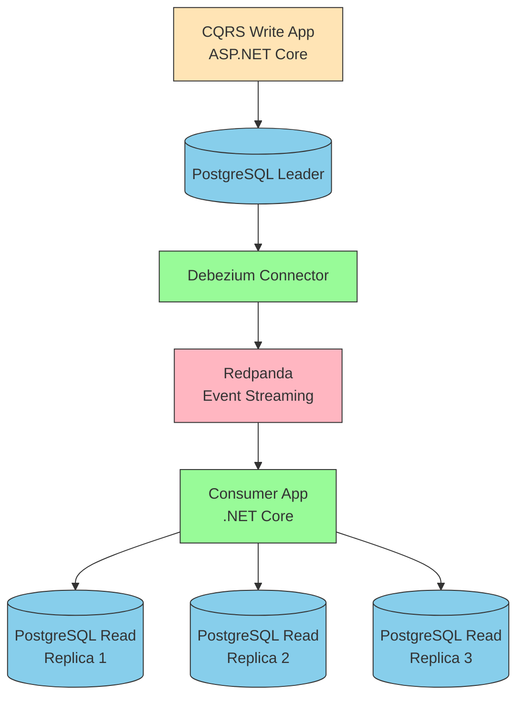

# System Architecture Diagram

```mermaid
graph TD
    A[CQRS Write App<br/>ASP.NET Core] --> B[(PostgreSQL Leader)]
    B --> C[Debezium Connector]
    C --> D[Redpanda<br/>Event Streaming]
    D --> E[Consumer App<br/>.NET Core]
    E --> F[(PostgreSQL Read<br/>Replica 1)]
    E --> G[(PostgreSQL Read<br/>Replica 2)]
    E --> H[(PostgreSQL Read<br/>Replica 3)]
    
    style A fill:#FFE4B5,stroke:#333
    style B fill:#87CEEB,stroke:#333
    style C fill:#98FB98,stroke:#333
    style D fill:#FFB6C1,stroke:#333
    style E fill:#98FB98,stroke:#333
    style F fill:#87CEEB,stroke:#333
    style G fill:#87CEEB,stroke:#333
    style H fill:#87CEEB,stroke:#333
```