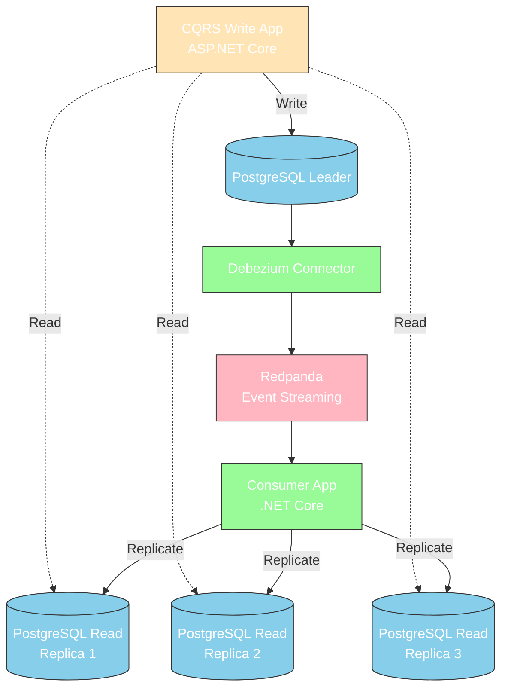

# System Architecture Diagram

```mermaid
graph TD
    A[CQRS Write App<br/>ASP.NET Core] -->|Write| B[(PostgreSQL Leader)]
    A -.->|Read| F[(PostgreSQL Read<br/>Replica 1)]
    A -.->|Read| G[(PostgreSQL Read<br/>Replica 2)]
    A -.->|Read| H[(PostgreSQL Read<br/>Replica 3)]
    B --> C[Debezium Connector]
    C --> D[Redpanda<br/>Event Streaming]
    D --> E[Consumer App<br/>.NET Core]
    E -->|Replicate| F
    E -->|Replicate| G
    E -->|Replicate| H
    
    style A fill:#FFE4B5,stroke:#333,color:#fff
    style B fill:#87CEEB,stroke:#333,color:#fff
    style C fill:#98FB98,stroke:#333,color:#fff
    style D fill:#FFB6C1,stroke:#333,color:#fff
    style E fill:#98FB98,stroke:#333,color:#fff
    style F fill:#87CEEB,stroke:#333,color:#fff
    style G fill:#87CEEB,stroke:#333,color:#fff
    style H fill:#87CEEB,stroke:#333,color:#fff
```